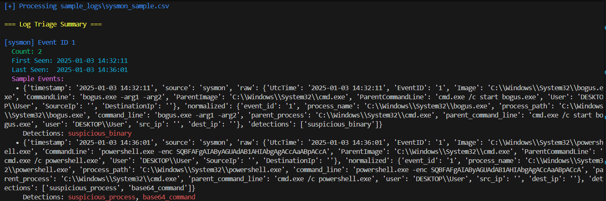

# 🔍 Event Sentinel — Lightweight Cross-Log Threat Detection (Python)

Event Sentinel is a modular log analysis tool capable of detecting suspicious activity across **Sysmon**, **Windows Event Logs**, and **Web Server Logs**.

It normalizes events into a shared structure, applies detection rules, and outputs clean alerts for fast triage.

---

## ✨ Features

- 🧩 Multi-format log parsing (Sysmon CSV, WEVT XML, Apache/Nginx)
- 🔄 Normalized `Event` objects
- 🛡️ Detection engine using custom rules
- 📘 Clean CLI tool (`main.py`)
- 🧪 Sample logs included
- 🚀 Small, fast, and extensible

---

## 📦 Project Structure

```css
EventSentinel/
│── main.py
│── cli.py
│── event.py
│── detector.py
│── rules.py
│── reporter.py
│── color.py
│── parsers/
│ ├── __init__.py
│ ├── sysmon_parser.py
│ ├── wevt_parser.py
│ ├── web_parser.py
│── sample_logs/
│ ├── sysmon_sample.csv
│ ├── windows_events.xml
│ ├── web_access.log
│── LICENSE
│── README.md
│── requirements.txt
```
---

## ▶️ Usage

### **Sysmon**
```bash
python main.py --type sysmon --file sample_logs/sysmon_sample.csv
```
<p align="center">
  
</p>


### **Windows Event Log (XML)**
```bash
python main.py --type windows --file sample_logs/windows_events.xml
```

### **Web Server Logs**
```bash
python main.py --type web --file sample_logs/web_access.log
```

### **Auto-detection (let the tool decide)**
```bash
python main.py --file sample_logs/sysmon_sample.csv
```
---

## 📑 Output Reports (JSON / CSV)
```bash
python main.py --file sample_logs/sysmon_sample.csv --output both
```
Reports will be saved under:

```bash
./reports/
    ├── report.json
    ├── report.csv
```
---
## 🧪 Sample Alert Output (Console)

```
=== Detected Threats ===

[sysmon] Event 1
  • Suspicious PowerShell invocation detected
  • Encoded command found (-enc)
  => Score: High
```
---

## 🛠️ Extending the Project

Add a new rule:

Edit `rules.py` and return matches using the `Event` class.

Add a new log type:

Create a new parser in `parsers/` and register it in `parsers/__init__.py`.

The engine automatically handles:

parsing → normalization → detection → reporting
---

## 📄 Requirements

Install dependencies:
```bash
pip install -r requirements.txt
```
---

